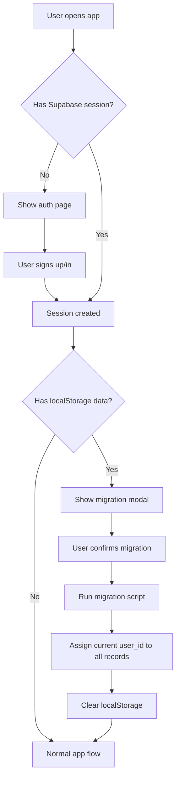

# Story 2.3.6: Migration Strategy & Solutions to Blocking Issues

**Date:** September 30, 2025
**Status:** RESOLVED - Ready for Implementation
**PM:** John

---

## Executive Summary

Codex identified **3 critical blocking issues** for Story 2.3.6 (Unified Note Data Model). This document provides **concrete solutions** with implementation details.

### Issues Resolved

| Issue | Severity | Status | Solution |
|-------|----------|--------|----------|
| Journal entries lack `title` field | 🚨 BLOCKING | ✅ RESOLVED | Auto-generate titles from date + content preview |
| Legacy string IDs incompatible with UUID | 🚨 BLOCKING | ✅ RESOLVED | Generate new UUIDs, preserve legacy IDs in metadata |
| localStorage data lacks `userId` | 🚨 BLOCKING | ✅ RESOLVED | One-time migration on first authenticated login |

---

## Issue 1: Journal Entries Need Titles

### Problem Statement

**Current Schema:**
```typescript
// src/components/journal/JournalStream.tsx:16
interface JournalEntry {
  id: string
  date: string        // ✅ Has date
  content: string
  lastModified: string
  // ❌ NO title field
}
```

**Proposed Schema:**
```sql
-- docs/prd.md:661
CREATE TABLE notes (
  title TEXT NOT NULL,  -- ⚠️ CONFLICT: Journal entries don't have titles!
  ...
)
```

**Why This Is Blocking:**
Migration script cannot insert journal entries without violating `NOT NULL` constraint.

---

### Solution: Auto-Generated Titles

#### Strategy 1: Date-Based Titles (RECOMMENDED)

**Logic:**
```typescript
function generateJournalTitle(entry: JournalEntry): string {
  const date = new Date(entry.date)
  const weekday = date.toLocaleDateString('en-US', { weekday: 'long' })
  const formattedDate = date.toLocaleDateString('en-US', {
    month: 'short',
    day: 'numeric',
    year: 'numeric'
  })

  return `Journal Entry - ${weekday}, ${formattedDate}`
  // Example: "Journal Entry - Monday, Sep 30, 2024"
}
```

**Pros:**
- ✅ Deterministic (same input = same output)
- ✅ Human-readable
- ✅ Chronologically sortable
- ✅ No parsing/NLP required

**Cons:**
- ⚠️ Generic (not descriptive of content)
- ⚠️ Multiple entries same day need disambiguation

**Handling Same-Day Entries:**
```typescript
function generateJournalTitle(entry: JournalEntry, existingTitles: string[]): string {
  const baseTitle = `Journal Entry - ${formatDate(entry.date)}`

  // Check for conflicts
  if (!existingTitles.includes(baseTitle)) {
    return baseTitle
  }

  // Add time suffix for disambiguatio
  const time = new Date(entry.lastModified).toLocaleTimeString('en-US', {
    hour: 'numeric',
    minute: '2-digit'
  })
  return `${baseTitle} (${time})`
  // Example: "Journal Entry - Monday, Sep 30, 2024 (2:35 PM)"
}
```

---

#### Strategy 2: Content-Derived Titles (ALTERNATIVE)

**Logic:**
```typescript
function generateJournalTitle(entry: JournalEntry): string {
  const date = formatShortDate(entry.date) // "Sep 30"

  // Extract first meaningful sentence
  const plainText = stripHtml(entry.content)
  const firstSentence = plainText.split(/[.!?]/)[0].trim()

  if (firstSentence.length > 50) {
    return `${date}: ${firstSentence.substring(0, 47)}...`
  }

  if (firstSentence.length > 0) {
    return `${date}: ${firstSentence}`
  }

  // Fallback for empty entries
  return `Journal Entry - ${date}`
}
```

**Examples:**
- `"Sep 30: Had an interesting conversation with a colleague..."`
- `"Sep 29: Took a long walk in the park this morning"`
- `"Sep 28: Reading 'The Power of Now' and the concept of presence"`

**Pros:**
- ✅ More descriptive
- ✅ Helps identify entries at a glance
- ✅ Useful for search results

**Cons:**
- ⚠️ Non-deterministic (content changes = title changes)
- ⚠️ Requires HTML stripping
- ⚠️ Edge cases (empty entries, HTML-only content)

---

### Recommended Approach: **Hybrid Strategy**

**Implementation:**
```typescript
// src/lib/migrations/generateJournalTitle.ts

export function generateJournalTitle(
  entry: JournalEntry,
  options: {
    useContentPreview?: boolean
    existingTitles?: string[]
  } = {}
): string {
  const date = new Date(entry.date)
  const shortDate = date.toLocaleDateString('en-US', {
    month: 'short',
    day: 'numeric'
  })

  // Try content-based title first
  if (options.useContentPreview && entry.content.trim()) {
    const plainText = stripHtml(entry.content)
    const firstSentence = plainText
      .split(/[.!?]/)
      .find(s => s.trim().length > 10)
      ?.trim()

    if (firstSentence && firstSentence.length <= 60) {
      return `${shortDate}: ${firstSentence}`
    }

    if (firstSentence && firstSentence.length > 60) {
      return `${shortDate}: ${firstSentence.substring(0, 57)}...`
    }
  }

  // Fallback to date-based title
  const fullDate = date.toLocaleDateString('en-US', {
    weekday: 'long',
    month: 'short',
    day: 'numeric',
    year: 'numeric'
  })
  const baseTitle = `Journal Entry - ${fullDate}`

  // Handle same-day duplicates
  if (options.existingTitles?.includes(baseTitle)) {
    const time = new Date(entry.lastModified).toLocaleTimeString('en-US', {
      hour: 'numeric',
      minute: '2-digit'
    })
    return `${baseTitle} (${time})`
  }

  return baseTitle
}

function stripHtml(html: string): string {
  return html
    .replace(/<[^>]*>/g, '') // Remove HTML tags
    .replace(/&nbsp;/g, ' ')  // Replace HTML entities
    .replace(/\s+/g, ' ')     // Normalize whitespace
    .trim()
}
```

**Migration Usage:**
```typescript
// During localStorage → Supabase migration
const journalEntries = getLocalStorageJournalEntries()
const existingTitles: string[] = []

for (const entry of journalEntries) {
  const title = generateJournalTitle(entry, {
    useContentPreview: true,
    existingTitles
  })

  await supabase.from('notes').insert({
    title,
    content: entry.content,
    note_type: 'journal-entry',
    metadata: {
      journalDate: entry.date,
      legacyId: entry.id
    },
    // ... other fields
  })

  existingTitles.push(title)
}
```

---

## Issue 2: Legacy String IDs vs. UUID Requirement

### Problem Statement

**Current IDs:**
```typescript
// src/components/journal/JournalStream.tsx:46
const newTodayEntry: JournalEntry = {
  id: `entry-${today}`,  // ❌ "entry-2024-09-30"
  // ...
}

// src/lib/notes.ts:10
export function generateNoteId(): string {
  return `note-${Date.now()}-${Math.random().toString(36).substr(2, 9)}`
  // ❌ "note-1718062123-abc"
}
```

**Proposed Schema:**
```sql
-- docs/prd.md:659
CREATE TABLE notes (
  id UUID PRIMARY KEY DEFAULT gen_random_uuid(),  -- ⚠️ CONFLICT!
  ...
)
```

**Why This Is Blocking:**
- Cannot insert string IDs into UUID column
- Foreign key relationships (links table) reference these string IDs
- Link HTML contains `data-note-id="note-1234-abc"` attributes

---

### Solution: Generate New UUIDs, Preserve Legacy IDs

#### Migration Strategy

**Step 1: Create ID Mapping Table**
```typescript
// During migration
const idMapping = new Map<string, string>()

// For each legacy record
for (const legacyEntry of localStorageData) {
  const newUuid = crypto.randomUUID() // or Supabase gen_random_uuid()
  idMapping.set(legacyEntry.id, newUuid)
}
```

**Step 2: Store Legacy ID in Metadata**
```sql
-- Supabase schema (already in prd.md:667)
CREATE TABLE notes (
  id UUID PRIMARY KEY DEFAULT gen_random_uuid(),
  metadata JSONB DEFAULT '{}',
  ...
)

-- Migration inserts
INSERT INTO notes (id, title, content, note_type, metadata, ...)
VALUES (
  gen_random_uuid(),
  'Journal Entry - Sep 30, 2024',
  'Had an interesting conversation...',
  'journal-entry',
  jsonb_build_object(
    'journalDate', '2024-09-30',
    'legacyId', 'entry-2024-09-30'  -- ✅ PRESERVED
  ),
  ...
)
```

**Step 3: Update Link References**
```typescript
// Migration script
async function migrateLinkReferences(
  idMapping: Map<string, string>
) {
  const localStorageLinks = getLocalStorageLinks()

  for (const link of localStorageLinks) {
    await supabase.from('links').insert({
      source_note_id: idMapping.get(link.sourceId),  // ✅ Mapped to UUID
      target_note_id: idMapping.get(link.targetId),  // ✅ Mapped to UUID
      link_type: 'created_from',
      created_at: link.createdAt
    })
  }
}
```

**Step 4: Update HTML Link Attributes**
```typescript
function updateHtmlLinkReferences(
  content: string,
  idMapping: Map<string, string>
): string {
  return content.replace(
    /data-note-id="([^"]+)"/g,
    (match, legacyId) => {
      const newUuid = idMapping.get(legacyId)
      return newUuid ? `data-note-id="${newUuid}"` : match
    }
  )
}

// During migration
const updatedContent = updateHtmlLinkReferences(entry.content, idMapping)
```

---

#### Implementation Details

**Migration Script Structure:**
```typescript
// scripts/migrate-to-unified-model.ts

interface MigrationResult {
  success: boolean
  migratedCount: number
  idMapping: Map<string, string>
  errors: Array<{ record: any; error: string }>
}

export async function migrateLocalStorageToSupabase(
  userId: string
): Promise<MigrationResult> {
  const result: MigrationResult = {
    success: false,
    migratedCount: 0,
    idMapping: new Map(),
    errors: []
  }

  try {
    // Step 1: Migrate journal entries
    // CRITICAL: Keep existingTitles accumulator outside loop to prevent collisions
    const journalEntries = getLocalStorageJournalEntries()
    const existingTitles: string[] = []
    for (const entry of journalEntries) {
      const newId = await migrateJournalEntry(entry, userId, existingTitles, result)
      result.idMapping.set(entry.id, newId)
    }

    // Step 2: Migrate notes
    const notes = getLocalStorageNotes()
    for (const note of notes) {
      const newId = await migrateNote(note, userId, result)
      result.idMapping.set(note.id, newId)
    }

    // Step 3: Migrate links with updated IDs
    await migrateLinks(result.idMapping)

    // Step 4: Update HTML content with new UUIDs
    await updateContentReferences(result.idMapping)

    result.success = true
  } catch (error) {
    console.error('Migration failed:', error)
    result.errors.push({ record: null, error: String(error) })
  }

  return result
}

async function migrateJournalEntry(
  entry: JournalEntry,
  userId: string,
  existingTitles: string[],
  result: MigrationResult
): Promise<string> {
  const title = generateJournalTitle(entry, {
    useContentPreview: true,
    existingTitles  // ✅ FIXED: Now receives accumulated titles
  })

  const { data, error } = await supabase
    .from('notes')
    .insert({
      user_id: userId,
      title,
      content: entry.content,
      note_type: 'journal-entry',
      is_pinned: false,
      metadata: {
        journalDate: entry.date,
        legacyId: entry.id,
        isSample: entry.isSample || false
      },
      created_at: entry.lastModified,
      updated_at: entry.lastModified
    })
    .select('id')
    .single()

  if (error) {
    result.errors.push({ record: entry, error: error.message })
    throw error
  }

  result.migratedCount++
  existingTitles.push(title)  // ✅ FIXED: Accumulate title to prevent collisions
  return data.id
}
```

---

## Issue 3: localStorage Data Lacks userId

### Problem Statement

**Current Data Structure:**
```typescript
// src/types/note.ts:7
export interface Note {
  id: string
  title: string
  content: string
  userId?: string  // ⚠️ OPTIONAL - most records don't have it
  // ...
}

// Sample data
const sampleEntry = {
  id: 'entry-2024-09-30',
  date: '2024-09-30',
  content: '...',
  isSample: true
  // ❌ No userId
}
```

**Proposed Schema:**
```sql
-- docs/prd.md:660
CREATE TABLE notes (
  user_id UUID REFERENCES auth.users(id) ON DELETE CASCADE,  -- ⚠️ MANDATORY
  ...
)

-- RLS Policy (docs/prd.md:705)
CREATE POLICY "Users can CRUD their own notes"
  ON notes FOR ALL
  USING (auth.uid() = user_id)  -- ⚠️ Enforces user_id matching
```

**Why This Is Blocking:**
- Cannot insert records without `user_id` (violates foreign key)
- RLS policies prevent access to records where `user_id` doesn't match current user
- Sample data has no user association

---

### Solution: One-Time Migration on First Authenticated Login

#### Migration Flow



#### Implementation

**Step 1: Migration Detection**
```typescript
// src/contexts/AuthContext.tsx

export function AuthProvider({ children }: { children: React.ReactNode }) {
  const [user, setUser] = useState<User | null>(null)
  const [needsMigration, setNeedsMigration] = useState(false)

  useEffect(() => {
    supabase.auth.getSession().then(({ data: { session } }) => {
      setUser(session?.user ?? null)

      // Check if migration needed
      if (session?.user) {
        const hasLocalData = checkLocalStorageData()
        const hasMigrated = localStorage.getItem('migration-completed')
        setNeedsMigration(hasLocalData && !hasMigrated)
      }
    })
  }, [])

  return (
    <AuthContext.Provider value={{ user, needsMigration, ... }}>
      {needsMigration && <MigrationModal userId={user!.id} />}
      {children}
    </AuthContext.Provider>
  )
}

function checkLocalStorageData(): boolean {
  const journalEntries = localStorage.getItem('journal-entries')
  const notes = localStorage.getItem('signum-notes')
  return !!(journalEntries || notes)
}
```

**Step 2: Migration Modal**
```typescript
// src/components/migration/MigrationModal.tsx

export function MigrationModal({ userId }: { userId: string }) {
  const [migrating, setMigrating] = useState(false)
  const [progress, setProgress] = useState<MigrationProgress | null>(null)

  const handleMigrate = async () => {
    setMigrating(true)

    try {
      const result = await migrateLocalStorageToSupabase(
        userId,
        (progress) => setProgress(progress)
      )

      if (result.success) {
        localStorage.setItem('migration-completed', 'true')
        localStorage.setItem('migration-id-mapping', JSON.stringify(
          Array.from(result.idMapping.entries())
        ))
        toast.success(`Migrated ${result.migratedCount} items successfully!`)
      } else {
        toast.error(`Migration failed: ${result.errors[0]?.error}`)
      }
    } catch (error) {
      toast.error('Migration error. Please contact support.')
    } finally {
      setMigrating(false)
    }
  }

  return (
    <Dialog open={true}>
      <DialogContent className="max-w-md">
        <DialogHeader>
          <DialogTitle>Welcome to Signum Cloud Sync!</DialogTitle>
          <DialogDescription>
            We found local journal entries on this device. Would you like to
            sync them to your account for cloud access?
          </DialogDescription>
        </DialogHeader>

        <div className="space-y-4">
          <div className="bg-muted p-4 rounded-md">
            <p className="text-sm">
              ✅ All your journal entries will be preserved<br/>
              ✅ Access from any device<br/>
              ✅ Automatic backups<br/>
              ⚠️ This is a one-time process (cannot be undone)
            </p>
          </div>

          {migrating && progress && (
            <Progress value={(progress.current / progress.total) * 100} />
          )}
        </div>

        <DialogFooter>
          <Button
            variant="outline"
            onClick={() => {
              // Skip migration (user can do it later)
              localStorage.setItem('migration-skipped', 'true')
            }}
            disabled={migrating}
          >
            Skip for Now
          </Button>
          <Button
            onClick={handleMigrate}
            disabled={migrating}
          >
            {migrating ? 'Migrating...' : 'Sync to Cloud'}
          </Button>
        </DialogFooter>
      </DialogContent>
    </Dialog>
  )
}
```

**Step 3: Handling Sample Data**

Sample journal entries and notes need special handling since they're not user-specific.

**Option A: Assign to Each User (RECOMMENDED)**
```typescript
// Each user gets their own copy of sample data
async function migrateSampleData(userId: string) {
  const sampleJournalEntries = getSampleJournalEntries()

  for (const entry of sampleJournalEntries) {
    await supabase.from('notes').insert({
      user_id: userId,  // ✅ Assign to current user
      title: generateJournalTitle(entry),
      content: entry.content,
      note_type: 'journal-entry',
      metadata: {
        journalDate: entry.date,
        isSample: true  // ✅ Preserve sample flag
      },
      // ...
    })
  }
}
```

**Pros:**
- ✅ Each user has full control over their samples
- ✅ Can delete/edit without affecting other users
- ✅ Works with RLS policies seamlessly

**Cons:**
- ⚠️ Duplicates sample data across users
- ⚠️ Storage cost (minimal - ~20 entries × ~1KB each = 20KB per user)

**Option B: Shared Sample Data (NOT RECOMMENDED)**
```typescript
// Create a special "system" user for samples
const SYSTEM_USER_ID = '00000000-0000-0000-0000-000000000000'

// RLS policy exception
CREATE POLICY "Users can read system samples"
  ON notes FOR SELECT
  USING (user_id = SYSTEM_USER_ID OR auth.uid() = user_id)
```

**Cons:**
- ❌ Complex RLS policies
- ❌ Users can't edit/delete samples
- ❌ Doesn't align with "personal journal" philosophy

**Recommendation: Use Option A (per-user samples)**

---

## Updated Acceptance Criteria for Story 2.3.6

### Modified Acceptance Criteria

**Original:**
> 2. ✅ Migrate localStorage journal entries → Supabase with `noteType: 'journal-entry'`

**Updated:**
> 2. ✅ Migrate localStorage journal entries → Supabase with:
>    - `noteType: 'journal-entry'`
>    - **Auto-generated `title`** using hybrid strategy (content preview + date fallback)
>    - **New UUID `id`**, legacy ID preserved in `metadata.legacyId`
>    - **Current authenticated user's `user_id`**

**Original:**
> 3. ✅ Migrate localStorage notes → Supabase with `noteType: 'custom'`

**Updated:**
> 3. ✅ Migrate localStorage notes → Supabase with:
>    - Legacy `'regular'` type → `noteType: 'custom'`
>    - **New UUID `id`**, legacy ID preserved in `metadata.legacyId`
>    - **Current authenticated user's `user_id`**
>    - HTML link references updated to use new UUIDs

### New Acceptance Criteria

**Add to Story 2.3.6:**

**Migration UX:**
1. ✅ Migration modal appears on first authenticated login if localStorage data exists
2. ✅ Modal explains: "Sync local entries to cloud for cross-device access"
3. ✅ User can choose "Sync to Cloud" or "Skip for Now"
4. ✅ Progress indicator shows migration status (X of Y items)
5. ✅ Success toast: "Migrated N journal entries and M notes"
6. ✅ localStorage cleared only after successful Supabase insertion
7. ✅ Migration can be retried if it fails

**Title Generation:**
1. ✅ Journal entries get auto-generated titles using hybrid strategy:
   - First choice: `"{ShortDate}: {First meaningful sentence}"`
   - Fallback: `"Journal Entry - {FullDate}"`
   - Conflict resolution: `"Journal Entry - {FullDate} ({Time})"`
2. ✅ Titles are deterministic (same input = same title)
3. ✅ Titles are human-readable and searchable
4. ✅ Empty journal entries get date-only titles

**ID Migration:**
1. ✅ All legacy string IDs converted to Supabase UUIDs
2. ✅ Legacy IDs preserved in `metadata.legacyId` for debugging
3. ✅ ID mapping maintained during migration for link reference updates
4. ✅ HTML link attributes (`data-note-id`) updated to new UUIDs
5. ✅ Links table foreign keys reference new UUIDs

**User Assignment:**
1. ✅ All migrated records assigned current authenticated user's `user_id`
2. ✅ Sample journal entries duplicated per-user (not shared)
3. ✅ `metadata.isSample` flag preserved for sample entries
4. ✅ RLS policies enforce user isolation post-migration

---

## Migration Script Outline

```typescript
// scripts/migrate-to-unified-model.ts

export interface MigrationProgress {
  current: number
  total: number
  stage: 'journal' | 'notes' | 'links' | 'content'
}

export interface MigrationResult {
  success: boolean
  migratedCount: number
  idMapping: Map<string, string>
  errors: Array<{ record: any; error: string }>
}

export async function migrateLocalStorageToSupabase(
  userId: string,
  onProgress?: (progress: MigrationProgress) => void
): Promise<MigrationResult> {
  const supabase = createClient()
  const result: MigrationResult = {
    success: false,
    migratedCount: 0,
    idMapping: new Map(),
    errors: []
  }

  try {
    // Count total items
    const journalEntries = getLocalStorageJournalEntries()
    const notes = getLocalStorageNotes()
    const total = journalEntries.length + notes.length

    // Stage 1: Migrate journal entries
    // CRITICAL: Keep existingTitles accumulator outside loop to prevent collisions
    const existingTitles: string[] = []
    let current = 0
    for (const entry of journalEntries) {
      const newId = await migrateJournalEntry(entry, userId, existingTitles, result)
      result.idMapping.set(entry.id, newId)
      onProgress?.({ current: ++current, total, stage: 'journal' })
    }

    // Stage 2: Migrate notes
    for (const note of notes) {
      const newId = await migrateNote(note, userId, result)
      result.idMapping.set(note.id, newId)
      onProgress?.({ current: ++current, total, stage: 'notes' })
    }

    // Stage 3: Migrate links
    onProgress?.({ current, total, stage: 'links' })
    await migrateLinks(result.idMapping, userId)

    // Stage 4: Update HTML content references
    onProgress?.({ current, total, stage: 'content' })
    await updateContentReferences(result.idMapping, userId)

    result.success = true
  } catch (error) {
    console.error('Migration failed:', error)
    result.errors.push({ record: null, error: String(error) })
  }

  return result
}

// Helper functions
async function migrateJournalEntry(
  entry: JournalEntry,
  userId: string,
  existingTitles: string[],
  result: MigrationResult
): Promise<string> { /* ... */ }

async function migrateNote(
  note: Note,
  userId: string,
  result: MigrationResult
): Promise<string> { /* ... */ }

async function migrateLinks(
  idMapping: Map<string, string>,
  userId: string
): Promise<void> { /* ... */ }

async function updateContentReferences(
  idMapping: Map<string, string>,
  userId: string
): Promise<void> { /* ... */ }

function generateJournalTitle(
  entry: JournalEntry,
  options?: { useContentPreview?: boolean; existingTitles?: string[] }
): string { /* ... */ }

function stripHtml(html: string): string { /* ... */ }

// localStorage access functions
function getLocalStorageJournalEntries(): JournalEntry[] { /* ... */ }
function getLocalStorageNotes(): Note[] { /* ... */ }
function getLocalStorageLinks(): Link[] { /* ... */ }
```

---

## Testing Strategy

### Unit Tests

```typescript
describe('generateJournalTitle', () => {
  it('generates date-based title for empty content', () => {
    const entry = {
      id: 'entry-2024-09-30',
      date: '2024-09-30',
      content: '',
      lastModified: '2024-09-30T10:00:00Z'
    }
    expect(generateJournalTitle(entry)).toBe(
      'Journal Entry - Monday, Sep 30, 2024'
    )
  })

  it('generates content-based title with preview', () => {
    const entry = {
      id: 'entry-2024-09-30',
      date: '2024-09-30',
      content: 'Had an interesting conversation today.',
      lastModified: '2024-09-30T10:00:00Z'
    }
    expect(generateJournalTitle(entry, { useContentPreview: true })).toBe(
      'Sep 30: Had an interesting conversation today'
    )
  })

  it('handles same-day duplicates with time suffix', () => {
    const entry = {
      id: 'entry-2024-09-30',
      date: '2024-09-30',
      content: '',
      lastModified: '2024-09-30T14:35:00Z'
    }
    const existingTitles = ['Journal Entry - Monday, Sep 30, 2024']
    expect(generateJournalTitle(entry, { existingTitles })).toBe(
      'Journal Entry - Monday, Sep 30, 2024 (2:35 PM)'
    )
  })
})

describe('ID migration', () => {
  it('generates valid UUIDs', () => {
    const legacyId = 'entry-2024-09-30'
    const newId = crypto.randomUUID()
    expect(newId).toMatch(/^[0-9a-f-]{36}$/)
  })

  it('preserves legacy ID in metadata', async () => {
    const entry = { id: 'entry-2024-09-30', /* ... */ }
    const result = await migrateJournalEntry(entry, 'user-uuid', {})
    const inserted = await supabase
      .from('notes')
      .select('metadata')
      .eq('id', result)
      .single()
    expect(inserted.data.metadata.legacyId).toBe('entry-2024-09-30')
  })
})
```

### Integration Tests

```typescript
describe('Full migration flow', () => {
  it('migrates all localStorage data to Supabase', async () => {
    // Setup: Create test localStorage data
    localStorage.setItem('journal-entries', JSON.stringify([
      { id: 'entry-1', date: '2024-09-30', content: 'Test 1', lastModified: '...' },
      { id: 'entry-2', date: '2024-09-29', content: 'Test 2', lastModified: '...' }
    ]))
    localStorage.setItem('signum-notes', JSON.stringify([
      { id: 'note-1', title: 'Note 1', content: 'Content', /* ... */ }
    ]))

    // Execute migration
    const result = await migrateLocalStorageToSupabase('test-user-id')

    // Verify
    expect(result.success).toBe(true)
    expect(result.migratedCount).toBe(3)
    expect(result.errors).toHaveLength(0)

    // Verify Supabase data
    const { data } = await supabase
      .from('notes')
      .select('*')
      .eq('user_id', 'test-user-id')
    expect(data).toHaveLength(3)
  })

  it('updates link references with new UUIDs', async () => {
    // Setup: Create linked entries
    localStorage.setItem('journal-entries', JSON.stringify([
      {
        id: 'entry-1',
        content: '<a data-note-id="note-1">link</a>',
        /* ... */
      }
    ]))
    localStorage.setItem('signum-links', JSON.stringify([
      { sourceId: 'entry-1', targetId: 'note-1', /* ... */ }
    ]))

    // Execute migration
    const result = await migrateLocalStorageToSupabase('test-user-id')

    // Verify link references updated
    const { data: entry } = await supabase
      .from('notes')
      .select('content')
      .eq('metadata->>legacyId', 'entry-1')
      .single()

    const newNoteId = result.idMapping.get('note-1')
    expect(entry.content).toContain(`data-note-id="${newNoteId}"`)
  })
})
```

### Manual Testing Checklist

- [ ] Fresh signup → no migration modal (no localStorage data)
- [ ] Signup with existing localStorage → migration modal appears
- [ ] Migration succeeds → data visible in app
- [ ] Migration preserves journal entry content and formatting
- [ ] Migration preserves note titles and content
- [ ] Migration preserves links between entries and notes
- [ ] Clicking note links after migration navigates correctly
- [ ] Sample entries marked with `isSample: true` in metadata
- [ ] Journal titles are human-readable
- [ ] Same-day entries get unique titles
- [ ] Migration can be skipped and retried later
- [ ] Failed migration shows error message
- [ ] Successful migration clears localStorage

---

## Timeline Impact

**Original Estimate:** 2-3 days
**Updated Estimate:** 3-4 days

**Additional Work:**
- ✅ Title generation logic (+0.5 days)
- ✅ ID migration and mapping (+0.5 days)
- ✅ Migration UX (modal, progress) (+0.5 days)
- ✅ Testing edge cases (+0.5 days)

**Total Addition:** +2 days (within acceptable range)

---

## Next Steps

1. **Product Owner Review:** Approve title generation strategy (hybrid approach)
2. **Update PRD:** Add new acceptance criteria to Story 2.3.6
3. **Implementation:** Begin Story 2.3.6 with solutions applied
4. **QA:** Test migration with real localStorage data from current deployment

---

**Status:** ✅ READY FOR IMPLEMENTATION
**Blocking Issues:** RESOLVED
**Estimated Timeline:** 3-4 days
**Risk:** Low (well-defined solutions)
